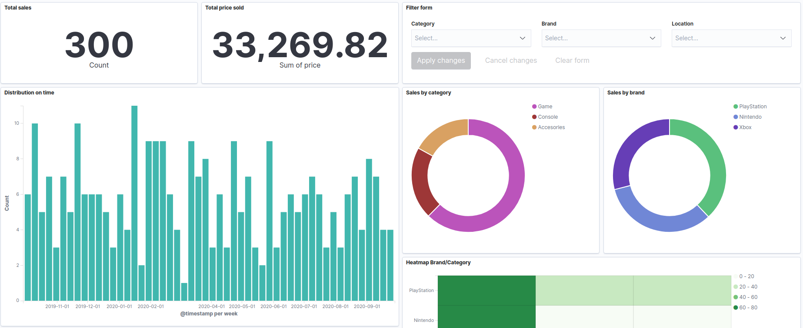
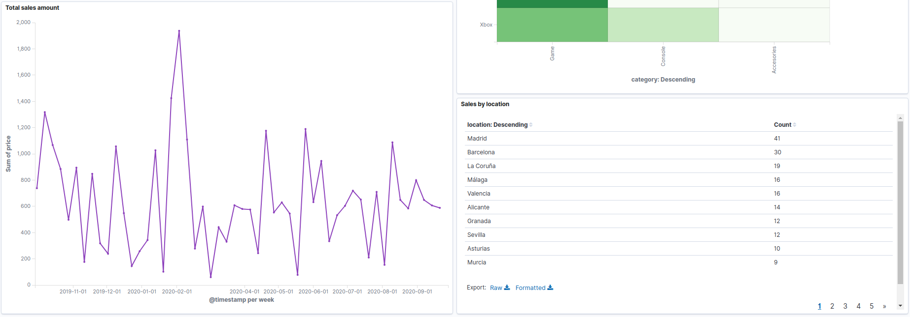
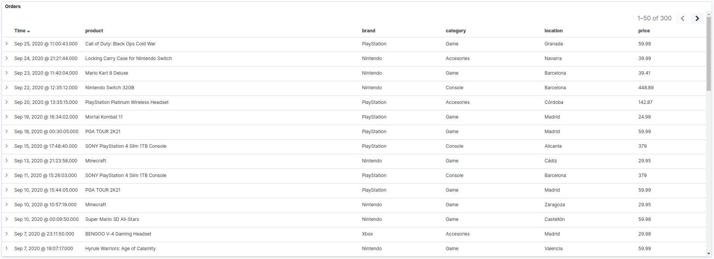
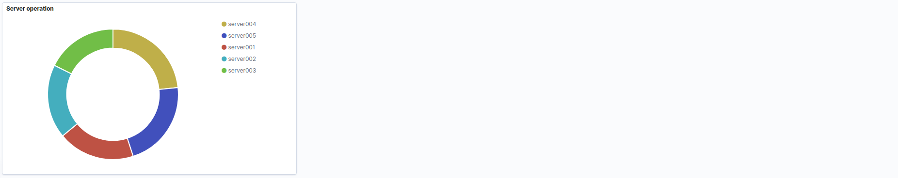

## Introduction

Populate an ELK and visualize information

## Documentation

- https://github.com/elastic/elasticsearch-php
- https://www.elastic.co/guide/en/elasticsearch/reference/current/mapping.html
- https://www.elastic.co/guide/en/kibana/current/dashboard-api-export.html
- https://github.com/CodelyTV/elastic-stack-example
- https://kb.objectrocket.com/elasticsearch/how-to-index-data-in-elasticsearch-using-the-php-client-library-127

## Execution

#### Prepare instances
```
docker-compose up -d
```

#### Install dependencies
```
cd app && composer install
``` 

#### Create Indexes
```
php create_index.php
```

#### Insert data by code
```
php insert_by_code.php
```

This insert the data in the index 'is-app'

It took 100 seconds to generate 50000 registers

#### Insert data by logs
```
php insert_by_logs.php
```

This insert the data in the index 'is-logstash-logs' using logstash and insert the data in the index 'filebeat-%{[agent.version]}-%{+yyyy.MM.dd}-%{index_num}' using filebeat

#### Enter Kibana
```
http://localhost:5601/
```

#### Import Structure to Kibana

Import `etc/kibana/dashboard_app.ndjson` to `Management -> Saved Object -> Import`






#### Shut down instances
```
docker-compose down
```

## TODO

* Create fields geo-point
  https://www.elastic.co/guide/en/elasticsearch/reference/current/geo-point.html


